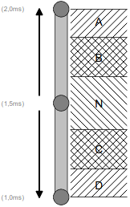

EkmfaRx library
===============

**EkmfaRx** is an asynchronous library designed to interprete automatically **EKMFA** RC pulse signals.

It supports:

- Up to 30 functions
- The recall of the last function
- Tunable time durations for burst, inter-burst, inter-command and last command recalling

**EKMFA** means **E**in-**K**anal-**M**ulti-**F**unktions-**A**uswahl: **O**ne **C**hannel **M**ulti-**F**onction **S**election.

Historically, at transmitter side, **EKMFA** was realized by counting manual RC stick movements to one direction (eg: **A** area). For example, by doing 2 RC stick movements to one direction, the function N°2 is invoked.
Up to 15 RC stick movements can be performed in each direction (**A** and **D** areas), this means up to 30 functions can be addressed.

Holding the RC stick in **C** area during a predefined time recalls the last command.

The **EkmfaRx** library interpretes these RC stick movements automatically: the invoked function is automatically determined!

Some examples of use cases:
-------------------------

* **Simulation of any EKMFA device**
* **Test of the EkmfaTx library**

Supported Arduinos:
------------------
* **ATmega328 (UNO)**
* **ATmega2560 (MEGA)**
* **ATtiny84 (Standalone)**
* **ATtiny85 (Standalone or Digispark)**
* **ATtiny167 (Digispark pro)**
* **ATmega32U4 (Leonardo, Micro, Pro Micro)**
* **ESP8266**

Tip and Tricks:
--------------
Develop your project on an arduino UNO or MEGA, and then shrink it by loading the sketch in an ATtiny or Digispark (pro).

API/methods:
-----------
* void **begin**(Rcul * **Rcul**, uint8_t **Ch** = RCUL_NO_CH, uint8_t **RxPin**, const uint8_t * **MyMapInFlash** = NULL,  uint8_t **MapSize** = 0)

    This method is used to initialize the library.

    * **Rcul**: Pointer on an Rcul object (eg: SoftRcPulseIn object)
    * **Ch**: N° of Channel in CPPM/SBUS frame (= RCUL_NO_CH in PWM, as not needed)
    * **RxPin**: The pin used to receive the RC signal
    * **MyMapInFlash**: Name of a function mapping table declared with the **EKMFA_FCT_MAP_TBL()** and **EKMFA_FCT_POS()** macros. (see below)

* uint8_t **process**()

    This method is in charge of interpreting RC signal and shall be called in the loop(). Blocking functions (such as delay() are forbidden in the loop()).

    Return value: 

    * When **MyMapInFlash** is present as second argument of **begin()** method: the ID of the invoked function (1 to 30) according to the **EKMFA_FCT_MAP_TBL()** definition, 0 if no command pending.
    * When **MyMapInFlash** is not present (or null) as second argument of **begin()** method: the return value is the raw number of bursts in **A** area or **D** area. To differentiate **A** and **D** areas, 0x80 is added to the number of bursts only for **A** area. For exemple, if 2 bursts are received in **A** area, the return value is 0x82, wheras, if 2 bursts are received in **D** area, the return value is 0x02. This can be used to determine the number of burts sent by an EKMFA generator (such as the **EkmfaTx** libray, for example). Knowing the number of bursts, it's possible to map each function with its corresponding number of bursts in the **EKMFA_FCT_MAP_TBL()** function mapping table.

* void **setEepBaseAddr**(uint16_t **EepBaseAddr**)

    This method sets the base address of the parameters in EEPROM.

    * **EepBaseAddr**: The base address in EEPROM of the parameters used by the library

* void **updateDurationMs**(uint8_t **WordIdx**, uint16_t **WordValue**)

    This method sets the duration in ms of the parameter WordIx and stores it in EEPROM.

    * **WordIdx**: EEPROM index of the parameter
        * **EKMFA_RX_RESET_DURATION_IDX** (see below)
        * **EKMFA_RX_BURST_DURATION_IDX** (see below)
        * **EKMFA_RX_INTER_BURST_DURATION_IDX** (see below)
        * **EKMFA_RX_LAST_RECALL_DURATION_IDX** (see below)
    * **WordValue**: The duration in ms

* uint16_t **getEepTotalSize**()

    This method returns the total EEPROM size (in byte) used by the library. This facilitates the EEPROM management for other EEPROM users.

* Macros:

	* **EKMFA_FCT_MAP_TBL(MyEkmfaMap)**: declare a function mapping table named **MyEkmfaMap**.
	* **EKMFA_FCT_POS(FunctId, BurstNb, ADarea)**: macro used to map a function to a specific number of bursts (in **A** area, or **D** area). For example, if **Function N°16** shall be invoked when **8** burts in **D** area are received, use **EKMFA_FCT_POS(16,  8, D_AREA)** in the **EKMFA_FCT_MAP_TBL(MyEkmfaMap)** function mapping table. When a function mapping table is declared, the name of the table shall be passed as second argument to the ** EKMFA begin()** method.

* Constants:

	* **EKMFA_RX_RESET_DURATION_IDX**: index for parameter in EEPROM used to store the duration at neutral position (in ms) to validate the pending command.
	* **EKMFA_RX_BURST_DURATION_IDX**: index for parameter in EEPROM used to store the duration at **A** or **D** position (in ms) to validate burst counting.
	* **EKMFA_RX_INTER_BURST_DURATION_IDX**: index for parameter in EEPROM used to store the duration (in ms) to validate an inter-burst.
	* **EKMFA_RX_LAST_RECALL_DURATION_IDX**: index for parameter in EEPROM used to store the duration at **C** position (in ms) to validate the recall of the last command.

* Constants for version management:
	* **EKMFA_RX_VERSION**: returns the library version
	* **EKMFA_RX_REVISION**: returns the library revision

Design considerations:
---------------------
In the loop(), all blocking functions are forbidden.
For example, the usage of the delay() fonction is forbidden!

Contact
-------

If you have some ideas of enhancement, please contact me by clicking on: [RC Navy](http://p.loussouarn.free.fr/contact.html).

