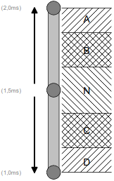

EkmfaTx library
===============

**EkmfaTx** is a pseudo asynchronous library designed to generate automatically **EKMFA** RC pulse signals.

It supports:

- Up to 30 functions
- The recall of the last function
- The optimized alternate command mode (when the amount of required functions is < 30)
- Tunable time durations for burst, inter-burst, inter-command and last command recalling

**EKMFA** means **E**in-**K**anal-**M**ulti-**F**unktions-**A**uswahl: **O**ne **C**hannel **M**ulti-**F**onction **S**election.

Historically, **EKMFA** was realized by counting manual RC stick movements to one direction (eg: **A** area). For example, by doing 2 RC stick movements to one direction, the function N°2 is invoked.
Up to 15 RC stick movements can be performed in each direction (**A** and **D** areas), this means up to 30 functions can be addressed.

Holding the RC stick in **C** area during a predefined time recalls the last command.

The **EkmfaTx** library simulates these RC stick movements automatically: no need to count them anymore!

Some examples of use cases:
-------------------------
* **Driving the EKMFA input of the Beier USM-RC-2 sound module**
* **Driving the EKMFA input of the NVM Multiswitch**
* **Driving the EKMFA input of any EKMFA compatible device**
* **Multiswitch to EKMFA converter**

Supported Arduinos:
------------------
* **ATmega328 (UNO)**
* **ATmega2560 (MEGA)**
* **ATtiny84 (Standalone)**
* **ATtiny85 (Standalone or Digispark)**
* **ATtiny167 (Digispark pro)**
* **ATmega32U4 (Leonardo, Micro, Pro Micro)**
* **ESP8266**

Tip and Tricks:
--------------
Develop your project on an arduino UNO or MEGA, and then shrink it by loading the sketch in an ATtiny or Digispark (pro).

API/methods:
-----------
* void **begin**(uint8_t **TxPin**, uint8_t * **InCmd**, uint8_t **CmdMaxNb**, uint8_t **CmdOptimization** = 0)

    This method is used to initialize the library with the optional options.

    * **TxPin**: The pin used to generate the RC pulses
    * **InCmd**: A buffer containing the commands
    * **CmdMaxNb**: The maximum number of commands to be managed
    * **CmdOptimization**: (optionnal parameter)
        * **EKMFA_TX_LAST_CMD_REPEAT_SUPPORT**: adds support for the recall of the last command
        * **EKMFA_TX_CMD_OPTIMIZATION_SUPPORT**: adds support for the optimized alternate commands. For example, if only 8 commands are needed, rather than always pulsing in the same direction, the odd commands are pulsed in the first direction (usually called **A** direction), and the even commands are pulsed in the second direction (usually called **D** direction). The longest commands takes 4 RC pulse bursts rather than 8 RC pulse bursts.
        * These 2 options can be combined by a "or" (**EKMFA_TX_LAST_CMD_REPEAT_SUPPORT** | **EKMFA_TX_CMD_OPTIMIZATION_SUPPORT**)
.

* void **updateOrder**()

    This method is in charge of setting the RC pulse width according to the commands and shall be called every 20 ms.

* void **process**()

    This method is in charge of generating RC pulses and shall be called in the loop(). Blocking functions (such as delay() are forbidden in the loop()).

* void **setEepBaseAddr**(uint16_t **EepBaseAddr**)

    This method sets the base address of the parameters in EEPROM.

    * **EepBaseAddr**: The base address in EEPROM of the parameters used by the library

* void **updateDurationMs**(uint8_t **WordIdx**, uint16_t **WordValue**)

    This method sets the duration in ms of the parameter WordIx and stores it in EEPROM.

    * **WordIdx**: EEPROM index of the parameter
        * **EKMFA_TX_RESET_DURATION_IDX** (see below)
        * **EKMFA_TX_BURST_DURATION_IDX** (see below)
        * **EKMFA_TX_INTER_BURST_DURATION_IDX** (see below)
        * **EKMFA_TX_LAST_RECALL_DURATION_IDX** (see below)
    * **WordValue**: The duration in ms

* uint16_t **getEepTotalSize**()

    This method returns the total EEPROM size (in byte) used by the library. This facilitates the EEPROM management for other EEPROM users.

* Constants:
	* **EKMFA_TX_LAST_CMD_REPEAT_SUPPORT**: enables the support of the recall of the last command
	* **EKMFA_TX_CMD_OPTIMIZATION_SUPPORT**: enables the support of the optimized alternate commands
	* **EKMFA_TX_RESET_DURATION_IDX**: index for parameter in EEPROM used to store the duration at neutral position (in ms) to validate the pending command.
	* **EKMFA_TX_BURST_DURATION_IDX**: index for parameter in EEPROM used to store the duration at **A** or **D** position (in ms) to validate burst counting.
	* **EKMFA_TX_INTER_BURST_DURATION_IDX**: index for parameter in EEPROM used to store the duration (in ms) to validate an inter-burst command.
	* **EKMFA_TX_LAST_RECALL_DURATION_IDX**: index for parameter in EEPROM used to store the duration at **C** position (in ms) to validate the recall of the last command.

* Constants for version management:
	* **EKMFA_TX_VERSION**: returns the library version
	* **EKMFA_TX_REVISION**: returns the library revision

Design considerations:
---------------------
In the loop(), all blocking functions are forbidden.
For example, the usage of the delay() fonction is forbidden!

Contact
-------

If you have some ideas of enhancement, please contact me by clicking on: [RC Navy](http://p.loussouarn.free.fr/contact.html).

