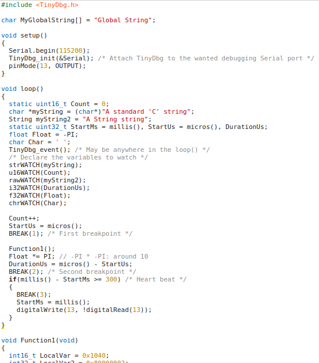
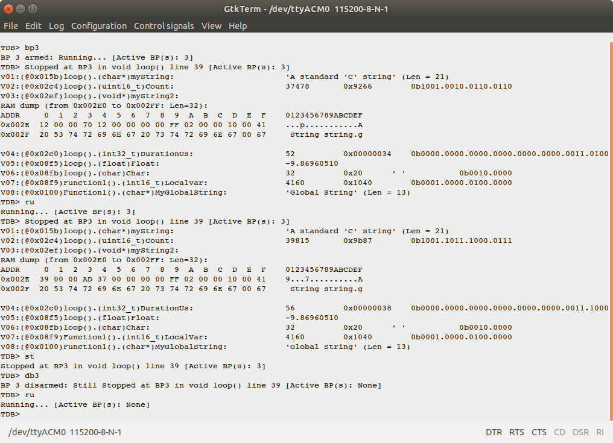

TinyDbg library: a tiny serial DEBUGGER
===============

**TinyDbg** is a library designed to debug arduino sketches just using a serial port (no timer needed).

The serial port can be chosen at initialization or later using **TinyDbg_attachToStream()** method.

It supports breakpoints and variable/ram/eeprom/flash inspection (Watch).

When the sketch is stopped due to a breakpoint, **TinyDbg** displays the breakpoint's ID and in which function the breakpoint is located.

The names of the variables are displayed as well as the name of the function where the variable are declared. With this feature, there is no confusion with local variables with the same name.

Basic local step-by-step can be achieved using successive breakpoints.

Currently, 8 breakpoints and 8 variables are supported.

By default, all the breakpoints are disarmed. The **TinyDbg_armBreakpoint(uint8_t ID)** method can be used in the **setup()** to pre-arm breakpoints at startup.

The code size of the **TinyDbg** library is around 10ko of flash and uses around 200 bytes of RAM.

All debug stuff can be easily deactivated by commenting the **TDBG_ACTIVE** compilation directive in **TinyDbg.h**.

Tip and Tricks:
--------------
Debug your project on an arduino UNO or MEGA, and then shrink it by recompiling and loading the debugged sketch in an ATtiny or Digispark (pro).

API/methods:
-----------
* **void TinyDbg_init(Stream *TdbgStream)**: to be placed in **setup()**
* **void TinyDbg_event(void)**: to be placed in **loop()**
* **void TinyDbg_armBreakpoint(uint8_t ID)**: to be used in **setup()** to pre-arm breakpoints at startup if needed.
* **void     TinyDbg_attachToStream(Stream *TdbgStream)**: to attach dynamically **TinyDbg** to another stream (eg: debug redirection)

Macros:
------
* **WATCH(a)**: same as i16WATCH(a) (see below)

* **i8WATCH(a)**: used to watch 8 bit signed integer (int8_t)
* **u8WATCH(a)**: used to watch 8 bit unsigned integer (uint8_t)

* **chrWATCH(a)**: used to watch character (char)

* **i16WATCH(a)**: used to watch 16 bit signed integer (int16_t)
* **u16WATCH(a)**: used to watch 16 bit unsigned integer (uint16_t)

* **i32WATCH(a)**: used to watch 32 bit signed integer (int32_t)
* **u32WATCH(a)**: used to watch 32 bit unsigned integer (uint32_t)

* **f32WATCH(a)**: used to watch 32 bit float (simple precision)

* **strWATCH(a)**: used to watch string (char*)

* **rawWATCH(a)**: used to watch raw data (void*)

* **BREAK(ID)**: used to place a breakpoint in the code 

Constants for version management:
--------------------------------
	* **TINY_DBG_VERSION**: returns the library version (integer)
	* **TINY_DBG_REVISION**: returns the library revision (integer)

TinyDbg usage in a sketch:
-------------------------

Example of debug session in a terminal:
--------------------------------------

Commands:
--------
* **h**:     Displays help
* **ha**:    Halts the sketch execution
* **ru**:    Runs the sketch
* **bp ID**: Arms the breakpoint ID
* **db ID**: Dearms the breakpoint ID
* **cb**:    Clears all the breakpoints
* **dv[pPeriodMs]**:    Displays the variables with optional display period in ms
* **dr Addr [lLen]**: Display RAM content starting at Addr address (eg: dr100l256)
* **de Addr [lLen]**: Display EEPROM content starting at Addr address (eg: de0l32)
* **df Addr [lLen]**: Display FLASH content starting at Addr address (eg: df200l512)
* **st**:    Displays the TinyDbg status

Contact
-------

If you have some ideas of enhancement, please contact me by clicking on: [RC Navy](http://p.loussouarn.free.fr/contact.html).

